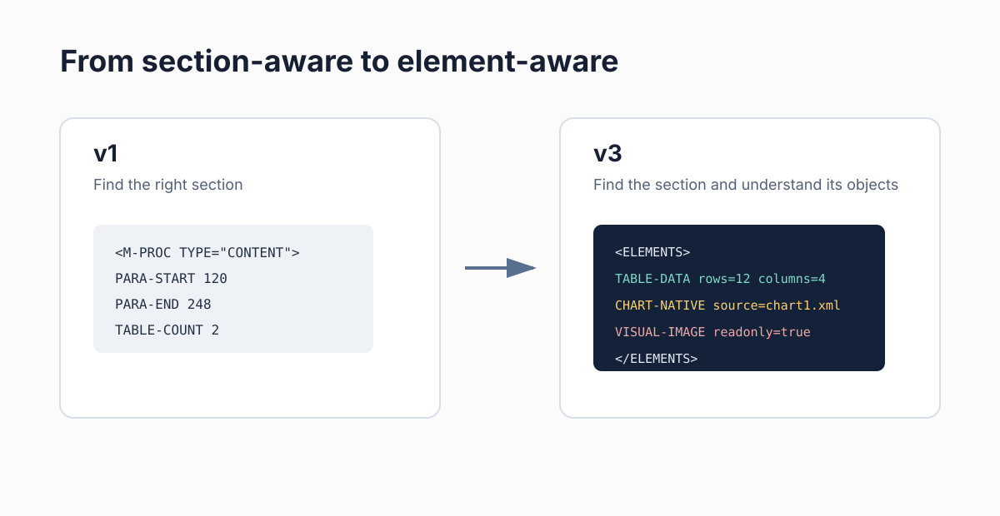
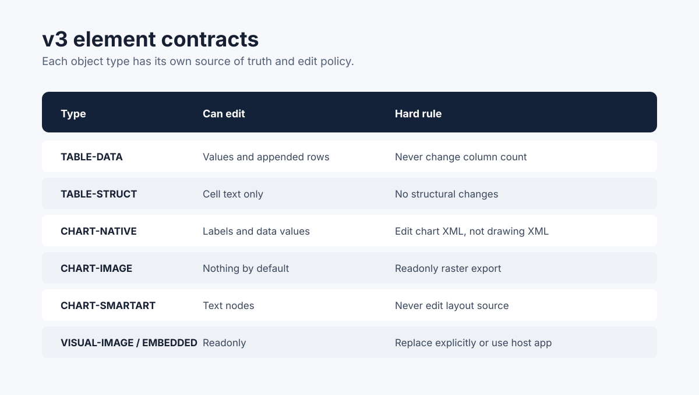
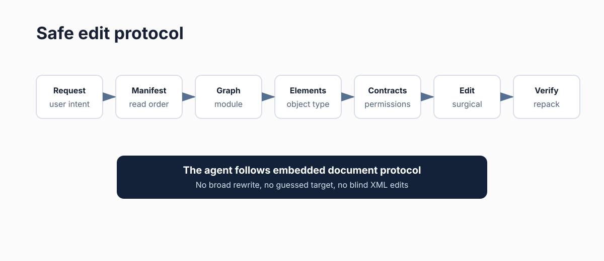
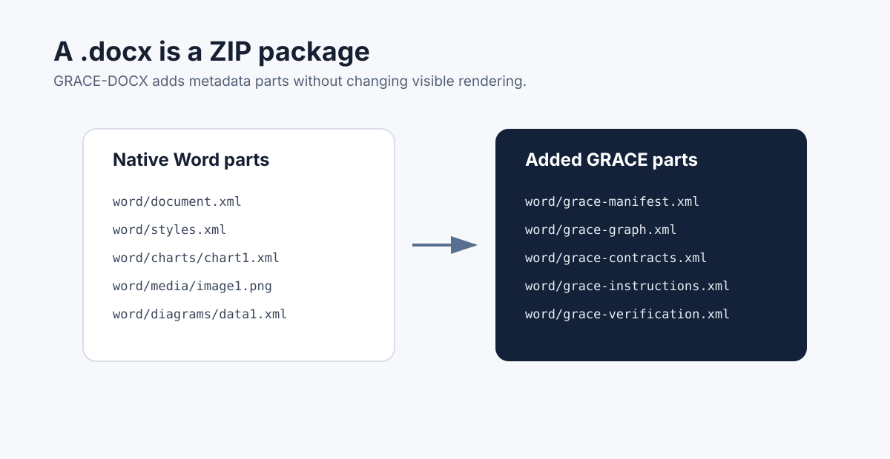

# GRACE Office

> Semantic markup for Office documents. GRACE-DOCX is the stable Word bootstrap. GRACE-PPTX is an additional PowerPoint bootstrap preview that applies the same embedded protocol to slides and shapes.

[](docs/release-v3.md)
[](LICENSE)
[](grace-docx-bootstrap.md)
[](grace-pptx-bootstrap.md)

## Why This Exists

Large Office documents are hostile to AI editing. A model has to scan thousands of XML nodes, infer where a section or slide module starts and ends, guess which table, chart, shape, or image is safe to change, and remember dependencies across a long context window.

That fails in predictable ways:

- the agent edits the wrong section;
- a table column structure changes accidentally;
- chart images are treated as live charts;
- SmartArt layout XML is modified instead of text data;
- repeated edits drift away from the original document structure.

GRACE solves this by adding a machine-readable layer inside the Office package itself. The visual rendering stays unchanged; the internal `.docx` or `.pptx` package becomes self-describing.

## Formats

| Format | Bootstrap | Status | Navigation model |
|---|---|---|---|
| Word `.docx` | [grace-docx-bootstrap.md](grace-docx-bootstrap.md) | Stable v3 | H1 modules, paragraph ranges, typed document elements |
| PowerPoint `.pptx` | [grace-pptx-bootstrap.md](grace-pptx-bootstrap.md) | Preview add-on v1 | Slide modules, authoritative slide order, shape inventory |

GRACE-PPTX is additional functionality beside GRACE-DOCX. It is not a successor format and does not replace the DOCX bootstrap.

## What v3 Adds

v1 answered: **where is the target section?**

v3 adds the second question: **what exactly is inside that section, and how can it be edited safely?**



GRACE-DOCX v3 inventories non-trivial document elements inside each H1 module:

| Element type | Editable | Source of truth |
|---|---:|---|
| `TABLE-DATA` | Data rows and cell values | `word/document.xml` |
| `TABLE-STRUCT` | Cell text only | `word/document.xml` |
| `CHART-NATIVE` | Labels and values | `word/charts/chartN.xml` and optional embedded workbook |
| `CHART-IMAGE` | No | `word/media/imageN.*`, readonly |
| `CHART-SMARTART` | Text nodes only | `word/diagrams/dataN.xml` |
| `VISUAL-IMAGE` | No | `word/media/imageN.*`, readonly |
| `EMBEDDED` | No direct XML edit | Host application required |



## How It Works

Attach the right bootstrap prompt and an Office document to a capable AI agent:

```text
[grace-docx-bootstrap.md]
[your-document.docx]

Run bootstrap.
```

```text
[grace-pptx-bootstrap.md]
[your-deck.pptx]

Run bootstrap.
```

For Word, the agent unpacks the `.docx`, analyzes Word XML, injects GRACE metadata, adds invisible bookmarks around every H1 section, and repacks the file.

For PowerPoint, the agent unpacks the `.pptx`, reads authoritative slide order from `ppt/presentation.xml`, inventories slide shapes, records the style fingerprint, injects GRACE metadata, and repacks the file.

After that, editing follows an embedded protocol:



The agent reads the manifest, locates the target module in the graph, checks typed elements or shapes, applies the relevant contract, performs the edit, runs verification, and returns a repacked Office file.

## Embedded Parts

GRACE-DOCX adds five XML files under `word/`:

| File | Purpose |
|---|---|
| `grace-manifest.xml` | Discovery beacon, read order, output policy |
| `grace-instructions.xml` | Agent behavior rules and anti-patterns |
| `grace-graph.xml` | Module map, paragraph ranges, bookmarks, element inventory |
| `grace-contracts.xml` | Global rules, type contracts, module overrides |
| `grace-verification.xml` | Structural invariants and post-edit checks |

It also adds standard invisible Word bookmarks:

```xml
<w:bookmarkStart w:id="100" w:name="GRACE_M-XXX"/>
...
<w:bookmarkEnd w:id="100"/>
```



GRACE-PPTX mirrors the same structure under `ppt/`:

| File | Purpose |
|---|---|
| `grace-manifest.xml` | Discovery beacon, read order, style fingerprint |
| `grace-instructions.xml` | Agent behavior rules and PowerPoint anti-patterns |
| `grace-graph.xml` | Slide order, module map, shape inventory, cross-links |
| `grace-contracts.xml` | Type contracts for placeholders, charts, images, SmartArt, notes, animations |
| `grace-verification.xml` | Slide order, shape identity, style, media, notes, hyperlink, and animation checks |

## Repository Structure

```text
grace-docx/
├── grace-docx-bootstrap.md        # latest stable bootstrap prompt, currently v3
├── grace-docx-bootstrap-v3.md     # explicit v3 copy
├── grace-pptx-bootstrap.md        # PowerPoint bootstrap preview, currently v1
├── archive/
│   └── grace-docx-bootstrap-v1.md # previous section-aware version
├── assets/                        # GitHub README diagrams
├── docs/
│   ├── github-publishing.md
│   ├── pptx-schema-v1.md
│   ├── release-v3.md
│   ├── schema-v3.md
│   ├── v3-transition.md
│   └── powerpoint-roadmap.md
├── CHANGELOG.md
└── README.md
```

## Quick Start

1. Download `grace-docx-bootstrap.md` for Word or `grace-pptx-bootstrap.md` for PowerPoint.
2. Open Claude, ChatGPT, Codex, or another agent that can inspect and edit OpenXML internals.
3. Attach the bootstrap prompt and your `.docx` or `.pptx`.
4. Say `Run bootstrap`.
5. Use the returned GRACE-enabled Office file for future edits.

## Example Edit Request

```text
[contract_GRACE.docx]

In the Approval Process section, add a rule:
purchases over $50,000 require CFO sign-off.
```

The agent should:

- read `word/grace-manifest.xml`;
- locate the target module in `word/grace-graph.xml`;
- inspect the module's `<ELEMENTS>`;
- apply `TypeContracts` and module overrides from `word/grace-contracts.xml`;
- update only the requested content;
- run `word/grace-verification.xml` checks before returning the file.

## Current Release

`v3.0.0` is the stable GRACE-DOCX element-aware bootstrap release. GRACE-PPTX is currently a preview v1 bootstrap.

See:

- [Release notes](docs/release-v3.md)
- [v3 transition guide](docs/v3-transition.md)
- [v3 schema notes](docs/schema-v3.md)
- [PowerPoint roadmap](docs/powerpoint-roadmap.md)
- [GRACE-PPTX v1 schema notes](docs/pptx-schema-v1.md)
- [GitHub publishing copy](docs/github-publishing.md)

## Relationship To GRACE

GRACE Office ports the GRACE methodology to document files.

GRACE stands for Graph-RAG Anchored Code Engineering: modules get contracts, semantic markers make navigation deterministic, and a graph keeps the system map current. GRACE-DOCX applies the idea to Word documents; GRACE-PPTX applies it to PowerPoint decks.

Original GRACE plugin for Claude Code: [osovv/grace-marketplace](https://github.com/osovv/grace-marketplace)

## Roadmap

- Harden v3 on real `.docx` samples with complex tables, charts, images, and SmartArt.
- Add runnable validators for GRACE-enabled `.docx` archives.
- Add reference XML templates under `grace/`.
- Harden GRACE-PPTX on real decks with sections, notes, SmartArt, charts, animations, and internal links.
- Explore the same pattern for `.xlsx` workbooks.

## License

MIT
