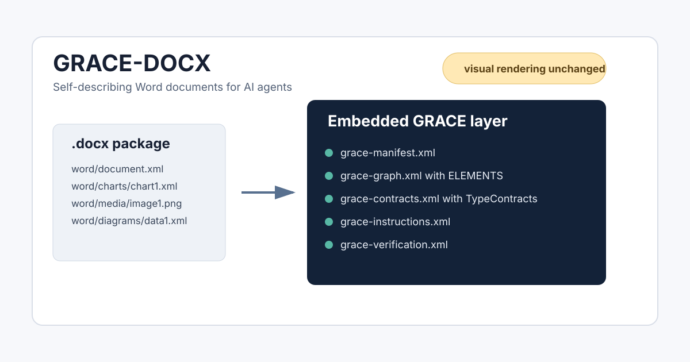

# GRACE-DOCX

> Element-aware semantic markup for Word documents. GRACE-DOCX embeds a navigation map, editing contracts, typed object inventory, and verification rules directly inside a `.docx`, so an AI agent can edit the document without guessing.

[](docs/release-v3.md)
[](LICENSE)
[](grace-docx-bootstrap.md)



## Why This Exists

Large Word documents are hostile to AI editing. A model has to scan thousands of XML nodes, infer where a section starts and ends, guess which table or chart is safe to change, and remember cross-section dependencies across a long context window.

That fails in predictable ways:

- the agent edits the wrong section;
- a table column structure changes accidentally;
- chart images are treated as live charts;
- SmartArt layout XML is modified instead of text data;
- repeated edits drift away from the original document structure.

GRACE-DOCX solves this by adding a machine-readable GRACE layer inside the document itself. The visual rendering stays unchanged; the internal `.docx` package becomes self-describing.

## What v3 Adds

v1 answered: **where is the target section?**

v3 adds the second question: **what exactly is inside that section, and how can it be edited safely?**


GRACE-DOCX v3 inventories non-trivial document elements inside each H1 module:

| Element type | Editable | Source of truth |
|---|---:|---|
| `TABLE-DATA` | Data rows and cell values | `word/document.xml` |
| `TABLE-STRUCT` | Cell text only | `word/document.xml` |
| `CHART-NATIVE` | Labels and values | `word/charts/chartN.xml` and optional embedded workbook |
| `CHART-IMAGE` | No | `word/media/imageN.*`, readonly |
| `CHART-SMARTART` | Text nodes only | `word/diagrams/dataN.xml` |
| `VISUAL-IMAGE` | No | `word/media/imageN.*`, readonly |
| `EMBEDDED` | No direct XML edit | Host application required |


## How It Works

Attach the bootstrap prompt and a Word document to a capable AI agent:

```text
[grace-docx-bootstrap.md]
[your-document.docx]

Run bootstrap.
```

The agent unpacks the `.docx`, analyzes Word XML, injects GRACE metadata, adds invisible bookmarks around every H1 section, and repacks the file.

After that, editing follows an embedded protocol:


The agent reads the manifest, locates the target module in the graph, checks typed elements, applies the relevant contract, performs the edit, runs verification, and returns a repacked `.docx`.

## Embedded Parts

GRACE-DOCX adds five XML files under `word/`:

| File | Purpose |
|---|---|
| `grace-manifest.xml` | Discovery beacon, read order, output policy |
| `grace-instructions.xml` | Agent behavior rules and anti-patterns |
| `grace-graph.xml` | Module map, paragraph ranges, bookmarks, element inventory |
| `grace-contracts.xml` | Global rules, type contracts, module overrides |
| `grace-verification.xml` | Structural invariants and post-edit checks |

It also adds standard invisible Word bookmarks:

```xml
<w:bookmarkStart w:id="100" w:name="GRACE_M-XXX"/>
...
<w:bookmarkEnd w:id="100"/>
```


## Repository Structure

```text
grace-docx/
├── grace-docx-bootstrap.md        # latest stable bootstrap prompt, currently v3
├── grace-docx-bootstrap-v3.md     # explicit v3 copy
├── archive/
│   └── grace-docx-bootstrap-v1.md # previous section-aware version
├── assets/                        # GitHub README diagrams
├── docs/
│   ├── release-v3.md
│   ├── schema-v3.md
│   ├── v3-transition.md
│   └── powerpoint-roadmap.md
├── CHANGELOG.md
└── README.md
```

## Quick Start

1. Download `grace-docx-bootstrap.md`.
2. Open Claude, ChatGPT, Codex, or another agent that can inspect and edit `.docx` internals.
3. Attach the bootstrap prompt and your `.docx`.
4. Say `Run bootstrap`.
5. Use the returned GRACE-enabled `.docx` for future edits.

## Example Edit Request

```text
[contract_GRACE.docx]

In the Approval Process section, add a rule:
purchases over $50,000 require CFO sign-off.
```

The agent should:

- read `word/grace-manifest.xml`;
- locate the target module in `word/grace-graph.xml`;
- inspect the module's `<ELEMENTS>`;
- apply `TypeContracts` and module overrides from `word/grace-contracts.xml`;
- update only the requested content;
- run `word/grace-verification.xml` checks before returning the file.

## Current Release

`v3.0.0` is the element-aware bootstrap release.

See:

- [Release notes](docs/release-v3.md)
- [v3 transition guide](docs/v3-transition.md)
- [v3 schema notes](docs/schema-v3.md)
- [PowerPoint roadmap](docs/powerpoint-roadmap.md)
- [GitHub publishing copy](docs/github-publishing.md)

## Relationship To GRACE

GRACE-DOCX ports the GRACE methodology to document files.

GRACE stands for Graph-RAG Anchored Code Engineering: modules get contracts, semantic markers make navigation deterministic, and a graph keeps the system map current. GRACE-DOCX applies the same idea to Word documents by embedding the graph, contracts, and verification protocol into the `.docx` archive.

Original GRACE plugin for Claude Code: [osovv/grace-marketplace](https://github.com/osovv/grace-marketplace)

## Roadmap

- Harden v3 on real `.docx` samples with complex tables, charts, images, and SmartArt.
- Add runnable validators for GRACE-enabled `.docx` archives.
- Add reference XML templates under `grace/`.
- Prepare a sibling GRACE-PPTX bootstrap for PowerPoint decks.
- Explore the same pattern for `.xlsx` workbooks.

## License

MIT
